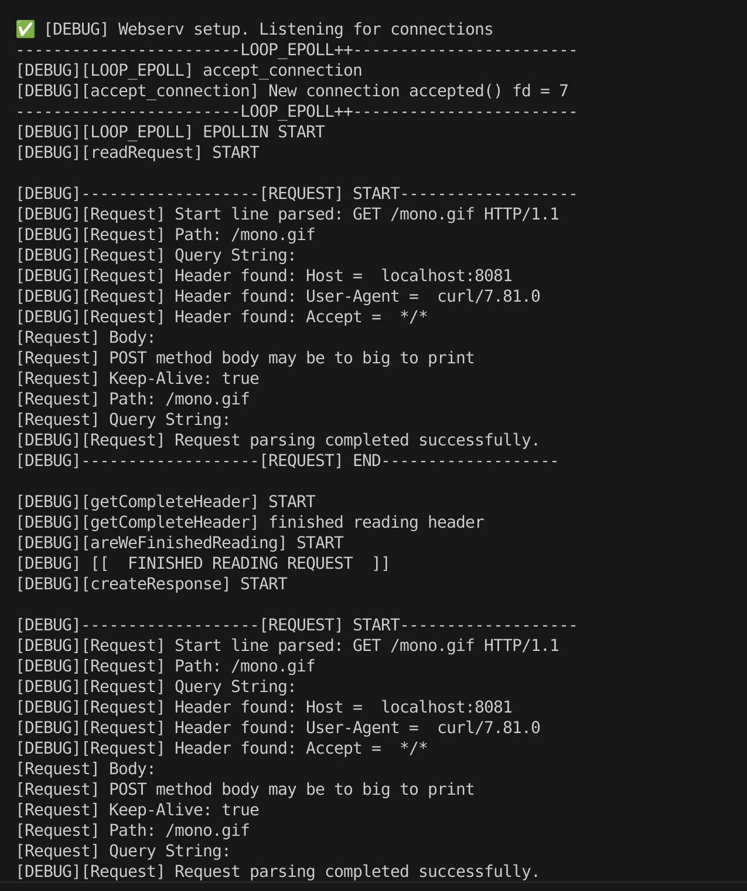

# Webserv: Your Own HTTP Server with C++98

Colaborador: 

[Subject](webserv_subject.pdf)

## About The Project

This project involves creating an HTTP web server from scratch, compatible with C++98. The goal is to implement the essential components of the HTTP/1.1 protocol to handle requests from clients, such as a web browser, concurrently and in a non-blocking manner.

The server is capable of:
* Handling multiple client connections simultaneously using I/O multiplexing (`poll`, `select`, `kqueue`, or `epoll`).
* Processing and responding to **GET**, **POST**, and **DELETE** HTTP methods.
* Serving static content (HTML, CSS, images, etc.) from a specified root directory.
* Managing file uploads to the server.
* Executing CGI scripts (e.g., in Python or PHP) to generate dynamic content.
* Being highly configurable through a text file inspired by NGINX's syntax.

---

## Usage

1.  **Compile the project:**
    ```bash
    make
    ```

2.  **Run the server:**
    ```bash
    ./webserv [path/to/your_config_file.conf]
    ```
---



## Resources

### Server setup

[How to build a simple HTTP server](https://medium.com/from-the-scratch/http-server-what-do-you-need-to-know-to-build-a-simple-http-server-from-scratch-d1ef8945e4fa)

[Simple server with C++](https://ncona.com/2019/04/building-a-simple-server-with-cpp/)

[C++ Web Programming](https://www.tutorialspoint.com/cplusplus/cpp_web_programming.htm)

### HTTP 1.1 (standard to follow) :

[HTTP/1.1 (RFC 2616)](https://www.rfc-editor.org/rfc/rfc2616.html)

[HTTP/1.1 : Message Syntax and Routing (RFC 7230)](https://www.rfc-editor.org/rfc/rfc7230.html)

[HTTP/1.1 : Semantics and Content (RFC 7231)](https://www.rfc-editor.org/rfc/rfc7231.html)

[HTTP/1.1 : Conditional Requests (RFC 7232)](https://www.rfc-editor.org/rfc/rfc7232.html)

[HTTP/1.1 : Range Requests (RFC 7233)](https://www.rfc-editor.org/rfc/rfc7233.html)

[HTTP/1.1 : Caching (RFC 7234)](https://www.rfc-editor.org/rfc/rfc7234.html)

[HTTP/1.1 : Authentication (RFC 7235)](https://www.rfc-editor.org/rfc/rfc7235.html)

### Other HTTP (legacy / future) :

[HTTP/1.0 (RFC 1945)](https://www.rfc-editor.org/rfc/rfc1945.html)

[HTTP/2 (RFC 7240)](https://www.rfc-editor.org/rfc/rfc7540.html)

[HTTP/2 : Header Compression (RFC 7241)](https://www.rfc-editor.org/rfc/rfc7541.html)

[FTP (RFC 959)](https://www.rfc-editor.org/rfc/rfc959.html)

### HTTP Header Syntax

[HTTP Request Methods](https://en.wikipedia.org/wiki/Hypertext_Transfer_Protocol#Request_methods)

[HTTP Status Codes](https://en.wikipedia.org/wiki/List_of_HTTP_status_codes)

[HTTP Header Break Style](https://stackoverflow.com/questions/5757290/http-header-line-break-style)

### Select and non-blocking

[Select](https://www.lowtek.com/sockets/select.html)

[Non-blocking I/O](https://www.ibm.com/support/knowledgecenter/ssw_ibm_i_72/rzab6/xnonblock.htm)

### CGI

[CGI : Getting Started](http://www.mnuwer.dbasedeveloper.co.uk/dlearn/web/session01.htm)

[CGI 1.1 Documentation](http://www.wijata.com/cgi/cgispec.html#4.0)

